# WORKSHOP PWA

Neste workshop será abordado questões que envolvem PWA, como por exemplo: "como e onde vivem, do que se alimentam...", brincadeiras à parte, vamos falar do que se trata, linguagem que está envolvida, como implementar, o checklist de itens que são defendidos para uma aplicação ser um Progressive Web App e também desenvolveremos uma :) 

Fora o conteúdo acima citado, também veremos como implementar uma PWA utilizando Vue.js, e também aprendendo mais sobre esse framework tão queridinho <3 

## Progressive Web Apps, o que são?

PWA nada mais são do que um **conjunto de técnicas** para desenvolver aplicações **web**, adicionando **progressivamente** funcionalidades de aplicativos nativos.

Para uma aplicação ser um Progressive Web App, é indicado que uma [**checklist**](https://developers.google.com/web/progressive-web-apps/checklist) seja seguida como guia, que contém como base assuntos relacionados à:

* Requisitos online
* Responsividade
* Funcionamento
* Dados disponíveis
* Interativo

Isso, é uma base, mas também conta com um checklist que contém *além* destes itens citados, pontos como:

* Indexabilidade e informação social
* UX (user experience) e UI (user interface) 
* Performance
* Cache
* Push notifications 
* Funcionalidades adicionais.

É importante ressaltar que na nossa prática aprenderemos o checklist **básico** de uma PWA por conta do tempo, mas nada impede de você aprimorar sua aplicação futuramente.

Mas em poucas palavras podemos dizer que uma PWA deve ser:

* Segura - servida via HTTPS
* Progressiva - poder ser acessada independente do browser
* Offline - retornar pelo menos URL principal offline
* Responsiva
* App Like - sensação de estar em APP nativo
* Enganjável 
* Instalável
* Atualizado

 
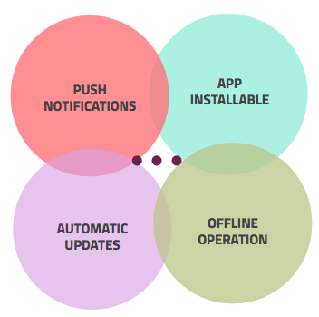

## Service Workers

Os Service Workers são o coração de uma PWA, basicamente sem ele um Progressive Web App não existe. É ele que permite que nossa aplicação se comporte como um APP nativo, funcione offline, acione notificações e muitas outras funcionalidades.

Service Worker são **scripts** que o browser executa em segundo plano, possibilitando recursos que *independem* da página web ou interação do usuário... Ou seja, nada mais são do que "maneiras de falar para o browser" o modo que ele **deve agir** em determinadas situações.

Abaixo, uma imagem demonstrando o funcionamento de um **SW**.

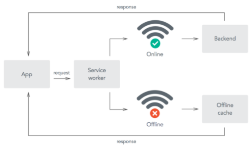

O exemplo da imagem acima, demonstra uma requisição por algum tipo de informação, tanto online quanto offline. Basicamente o nosso **SW** vai funcionar como um middleware da situação, assim, quando a aplicação requisitar algum serviço, a primeira parada vai ser nosso **SW**, que fará a avaliação:

- Se a aplicação estiver **online**, então será feita a requisição para o backend que trará a resposta necessitada.
- Se estiver **offline** a resposta será obtida atravéz do cache offline da aplicação, gerado e gerenciado pelo **SW**.


### Pré-requisitos para utilização


* Compatibilidade de navegadores 
* Aplicação ser servida via HTTPS
* Ter o service worker registrado

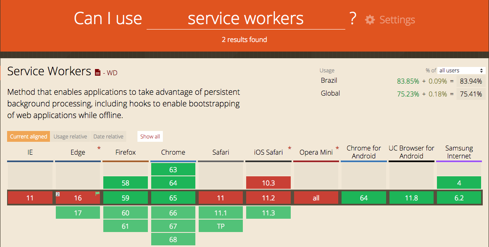

## Construindo a PWA

##### Passo 1: Clone do repositório do github

- Abra o terminal de seu computador
- [Repositório Github](https://github.com/milenevlacerda/womakers-code-summit)
- Acessando o link disponibilizado, faça o clone do repositório. Exemplo no código abaixo:

```
git clone https://github.com/milenevlacerda/womakers-code-summit.git
```

- Utilize a pasta **pwa-demo-ws**

##### Passo 2:

- Instale o **serve** para podermos servir nossa aplicação, ter acesso e assim testá-la

```
npm install -g serve
```

##### Passo 3:

- Rode o comando abaixo para servir o diretório clonado

```
cd pwa-demo-ws
serve client/
```

##### Passo 4:

- Abra seu navegador no endereço indicado no terminal
*http://localhost:5000*

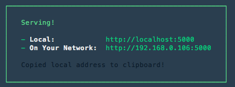

##### Passo 5:

- Abra seu projeto no **VSCODE**
- Na pasta **js/**, abra o arquivo **register.js**
- Nele, insira o código abaixo

### Registrando do Service Worker


```javascript
if ('serviceWorker' in navigator) {
  window.addEventListener('load', () => {
    navigator.serviceWorker.register('/sw.js')
     .then((registration) => {
      // Registrado com sucesso
      console.log('Service Worker registrado com sucesso');
     }).catch((err) => {
       // Registro falhou :(
       console.log('Registro do Service Worker falhou: ', err);
     })
  })
}
```

 - No seu **index.html** insira a linha abaixo antes do final da tag **<body>**

 ```
 <script src="js/sw/register.js"></script>
 ```

### Instalando do Service Worker


```javascript
var CACHE_NAME = "my-site-cache";

var urlsToCache = [
  "/", 
  "/css/main.css", 
  "img/womakerscode2.png"
];

self.addEventListener("install", (event) => {
  self.skipWaiting();
  event.waitUntil(
    caches.open(CACHE_NAME)
    .then((cache) => {
      console.log('Instalado');
      return cache.addAll(urlsToCache)
    })
  )
});
```

### Retornos de um Service Worker


```javascript
self.addEventListener("fetch", event => {
  event.respondWith(
    caches.match(event.request).then(response => {
      if (response) {
        return response;
      }
      return fetch(event.request);
    })
  );
});
```

### Atualização de um Service Worker

1. [x] Atualize o JS do seu SW (qualquer linha)
2. [x] Observe que no recarregamento da página o novo service worker será instalado.
3. [x] Neste momento, o novo SW ainda está no estado de **waiting**, ou seja, ainda não está ativo.
4. [x] Quando as páginas atuais forem fechadas pelo usuário, e reabertas o novo **sw** será instalado.

##### Atualizando o cache

```javascript
this.addEventListener("activate", event => {
  var cacheWhitelist = ["my-site-cache"];

  event.waitUntil(
    caches.keys().then(
      keyList => {
        return Promise.all(
          keyList.map( key => {
            if (cacheWhitelist.indexOf(key) === -1) {
              return caches.delete(key);
            }
          })
        );
     })
  );
});
```

## Manifest.json

O *manifest.json* é um arquivo, que como a extensão diz, é em json, que tem como objetivo declarar algumas configurações que sua PWA terá, como por exemplo: nome da aplicação, nome que aparecerá como descrição do APP quando instalado, icons, url de ínicio (ou seja, quando o app for aberto, por qual URL ele deve iniciar), display (tipo de layout, escondendo ou não barras de navegação), background color (cor de fundo da inicialização do app) e cor do tema.

Assim, o seu arquivo **manifest.json** deve ficar neste formato:

```json
{
  "name": "Application Name",
  "short_name": "App Name",
  "icons": [
    {
      "src": "/static/img/icons/logo-192x192.png",
      "sizes": "512x512",
      "type": "image/png"
    },
    {
      "src": "/static/img/icons/logo-512x512.png",
      "sizes": "512x512",
      "type": "image/png"
    }
  ],
  "start_url": "/index.html",
  "display": "standalone",
  "background_color": "#36d1b2",
  "theme_color": "#36d1b2",
  "color": "#fff"
}
```

E no seu **index.html** deve ser adicionado as seguintes tags:

```html
<html lang="pt-br" manifest="offline.manifest">
<link rel="icon" type="image/png" sizes="192x192" href="/static/img/icons/logo-192x192.png">
<link rel="icon" type="image/png" sizes="512x512" href="/static/img/icons/logo-512x512.png">
<link rel="manifest" href="/static/manifest.json">
```

## Avaliando a PWA

Passo a passo para avaliar sua PWA: [Lighthouse](https://developers.google.com/web/tools/lighthouse/)


## What Web Can do Today

[An overview of the device integration HTML5 APIs](https://whatwebcando.today/)

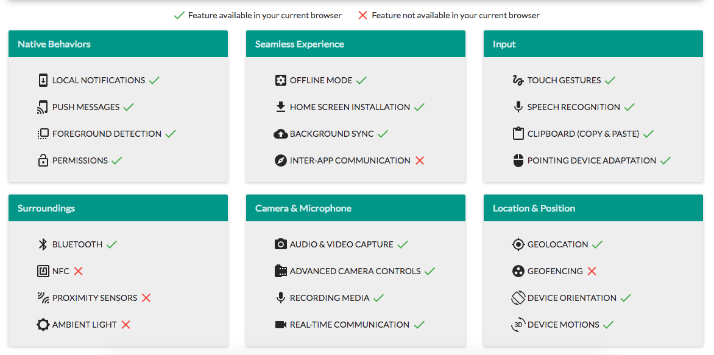


## Vue.js
     
##### O que é?

- Lib JS
- Reativo
- Auxilia no desenvolvimento de aplicações baseadas em components
- Baseado em melhores práticas de Angular e React
- Trabalha com Single File Components

##### Do que é composto? 

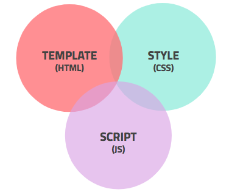

##### Exemplos?

Component em Vue:


Component com pré-processadores:


Modelo de declarações:

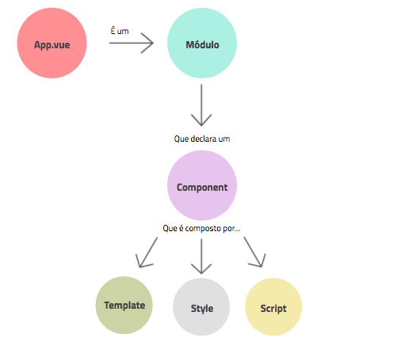


## PWA + Vue.js

Link do [Template](https://github.com/vuejs-templates/pwa) que será utilizado para a segunda parte do WS.

##### Pré requisitos:
- Npm
- Node.js

```
$ node --version
```

##### Instalação:

No terminal do seu seu computador...

**Passo 1:**

```
npm install vue-cli-g
```

**Passo 2:**

```
> vue init pwa your-project-name
> cd your-project-name
> npm install
> npm run dev
```

##### O que está incluso?
 - Suporte a toda aplicação PWA
 - SW precaching
 - Configurações de dev e prod via web pack
 - Ambiente pré-configurado para Testes unitários  Karma + Mocha + karma-webpack. 
 - Ambiente pré-configurado para Testes e2e com Nightwatch.

##### Estrutura:

Estrutura front-end do projeto

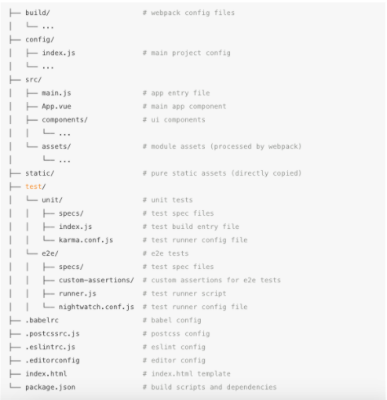

Onde a "mágica" acontece:

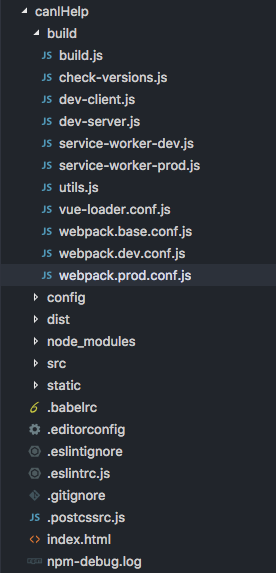

**Passo 3:**

Vamos utilizar um repositório já existente para esse workshop. 

- Volte ao projeto inicial que você clonou, e utilize a pasta **pwa-with-vue**
- Abra-a em seu editor de texto.

**Passo 4:**

Configure o local de cache de arquivos no Plugin Webpack + PWA

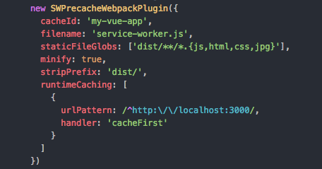

**Passo 5:**

Gere o Build da aplicação para produção para testar a PWA.

```
> npm run build
```

Após o build, verificar a pasta **dist/** gerada.

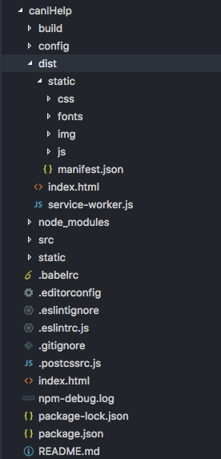

**Passo 5:**

Servir a aplicação

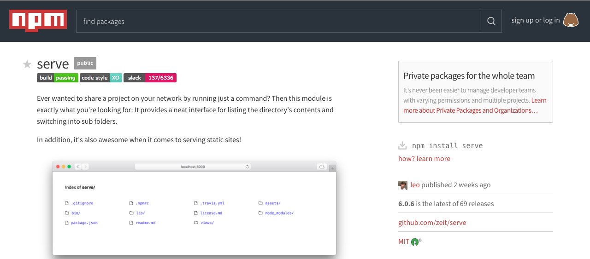

```
> serve dist/
```

**Passo 6:**

Testar e avaliar a PWA no [Lighthouse](https://developers.google.com/web/tools/lighthouse/) no browser na aba **audit**

## PWA x Nativo

Quando utilizar cada um: discussões

## Links

###### Exemplos de PWAs: 
[PWA Rocks](https://pwa.rocks/)

###### Case Studies: 
Saiba por que e como outros desenvolvedores usaram a web para criar incríveis experiências na web para seus usuários: [Google Developers](https://developers.google.com/web/showcase/)

###### Talks 

"Vue.js, apenas mais um framework JavaScript, será?"

Talk: [RSJS 2017](https://www.youtube.com/watch?v=CRMKpfxhY7Y&t=116s)

Slides: [RSJS2017](https://speakerdeck.com/milenevlacerda/vue-dot-js-apenas-mais-um-framework-javascript-sera) 

"Construindo PWA utilizando Vue.js"

Talk: [Brazil JS 2017](https://www.youtube.com/watch?v=jdEBLQVZRdo)

Slides: [Brazil JS 2017](https://speakerdeck.com/milenevlacerda/construindo-pwa-utilizando-vue-dot-js) 


###### Artigos

[No mar de libs e frameworks - Conhecendo Vue.js - Parte 1](https://braziljs.org/blog/no-mar-de-libs-e-frameworks-conhecendo-o-vue-js-parte/)

[No mar de libs e frameworks - Conhecendo Vue.js - Parte 2](https://braziljs.org/blog/no-mar-de-libs-e-frameworks-conhecendo-o-vue-js-parte/)


